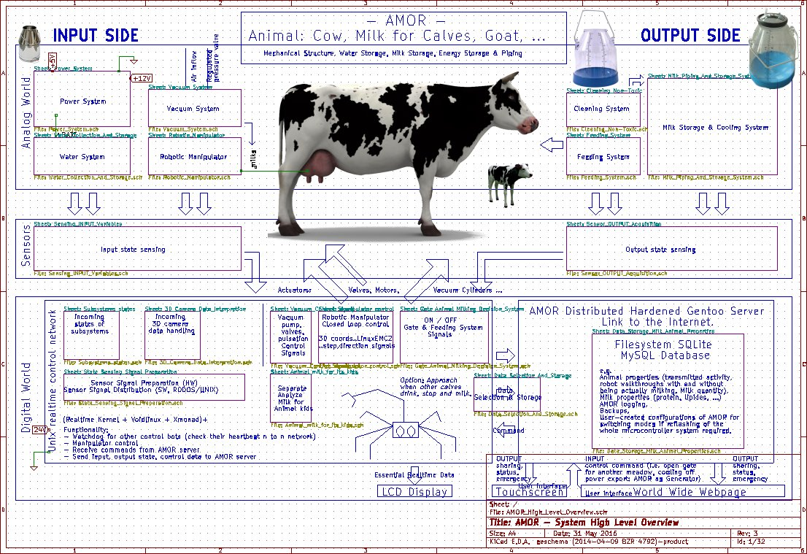
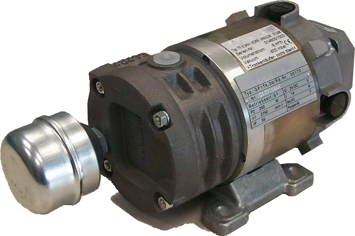
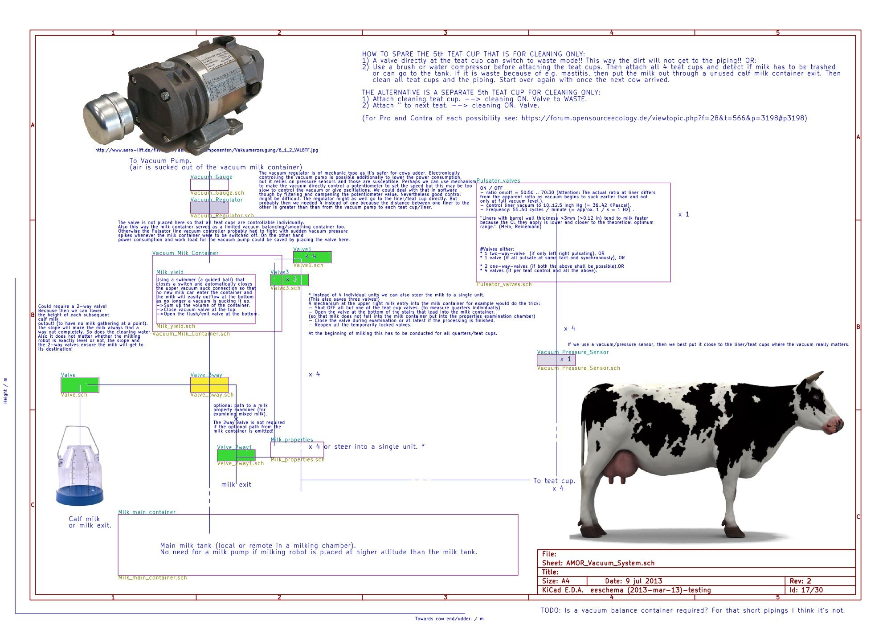

<a href="http://wiki.opensourceecology.de/index.php/Milking_robot">Autonomous Milking &amp; Other Robot</a> (=: AMOR)
===

###Indoor or outdoor (or both) mobile robot for automatic milking, feeding and herd management (among others).

Overview schematic
---

Characteristics
---
###Possible manipulator configurations:
* 1 Robotic 6 axes manipulator. 
* 2 Robotic 6 axes manipulator. Each the watchdog of the other one respectively.
* Animal child like: 6 axes manipulator + mobile base. (Approaching the animal to be milked in time and then even be allowed to "drink" from it will be the major issue.)

If 2 robotic arms are employed, then redundancy and operating speed (due to robotic cooperation) is increased. Yet path calculation is complicated (because next to the cow, the other manipulator is another dynamic obstacle to be collision avoided). If the simplistic specialized manipulators are used, then waiting time has to be calculated too because the reachable workspace is limited and the flexibility of the manipulator is far less than the industrial robot (earth worm).

* The recommended setup is to construct 2 independent, mirrored milking robots next to each other, such that both can help or replace each other.

###Milk container configurations
While the pipings and vacuum system will be built-in, an arbitrary milk container should be added.
Thinkable solutions may be:
* Pipe or tube downhill to the milking chamber where the container is located.
* Pump or suck the milk into a freely located container.
* Add a milk container and cooling system directly to the AMOR construction. (Requires reachability of the milk truck or similar.)May conflict with the mobility of the robot as well as with the  herd management.
* ...

###Milk management
Milk can be redirected to outlets for calves' milk and to the waste exit (waste system connected or left to nature).

###Water supply
It may harvest water from rain, a river, stream or any other water source, a water inlet for connection to the farm's water supply exists.

###Energy supply
* stand-alone (self-sustained, e.g. regenerative energy harvest) or
* external supply (e.g. plugged or transmitted from an electric grid, emergency power supply, or similar).

###Docking process
* A 3D camera determines the udder's, teats' positions.
* The robotic manipulator calculates the tool's teat cup grip and teat dock orientations.

* Paths are calculated:
  1. from current tool position and orientation (:= pose) to the teat cup grip pose.
  2. from the teat cup grip pose to the teat cup grip pose.

###Milk container cleaning system
(missing)
###Autonomous meadow management
(missing)

AMOR - Automatischer Melk Onboard Roboter
===
AMOR ist ein beweglicher (engl. mobiler) Roboter der mittels eines einfachen Greifarms, automatisch milkt. Ein Behälter oder Milchtank muss extern angeschlossen werden, ein Platz am mobilen Roboter könnte aber vorgesehen werden. Dies ermöglichst uns weitere Flexibilität. Eimer für Kälbermilch können unter automatisch vom Roboter gesteuerte Milchhähne gestellt werden.

Ein Anschluss an die Hauswasserversorgung mittels eines Gartenschlauchs ist vorgesehen. Es wird weiter versucht, Regenwasser aufzufangen oder andere Wasserquellen wie Flüsse, Bäche oder andere Gewässer als Wasserquelle für Trinkwasser oder den Reinigungsprozess der Roboterplattform zu verwenden.

Forum
===
Finally news for AMOR. Several design choices have been made:

* Controller: Beagle Bone Black (BBB) + Stepper drivers or Vacuum valves (robotic controller).
* RODOS (Realtime operating system), supports ARMv7 (=>BBB) better than Raspberry Pi, furthermore, I fear we'd get into serious trouble if using Raspberry Pi as it is neither real open source (processor) nor are the schematics available due to the 'manufacturing contract' with RS, Farnell/element14 and Reichelt - that and the not sufficient Real Time capabilities with jitter in the region of 4..20 [Xanomai + Linux] over 10..80 [Realtime Linux Kernel] to 600 [Realtime Linux Kernel again, sources vary!] so that PWM would only be possible with a frequency of 1 Hz or below in the latter case. The unit is micro seconds.
* BBB has 50+ GPIOs vs. 8 GPIOs of Rpi.
* BBB has 8 PWM pins vs. 0 on the Rpi.
* BBB has Cortex 8 1GHz processor vs. 700 MHz of the Rpi and the technology used in the BBB processor from TI uses parallel instructions among other improvements in preformance that make a big difference as first tests show [Source: Michael Leonhard].
* BBB has ADC modules inbuilt. (though DAC would be possible with both using a small external circuit or even pure software high frequency pin switching what is not viable as we need the computing power for our robotic manipulator.)
* The whole system will be powered by an old power supply of a PC running SUSE linux or a minimal python server or whatever proves the most viable for running blender and MySQL/SQLite as well as the network link at the same time.
* Alternatively at a later point the BBB can take over the webserver and storage responsibility too. This is only possible if the resources of the BBB are enough to control all the gates, the feeding AND the milking and still has reserves for the webserver thing (as traffic will be low). Then the power supply will be a custom green UPS that integrates with alternative energy (solar & steam as cooling the milk will give plenty of heat back - water storage will be heated up as an energy storage).
* Vacuum pump will be anything one can think of from a vacuum cleaner to a diffusion pump as we need a low degree of vacuum only. (it's not an electron beam precision machine!)

Details are still in development - the prototype has been scraped and now is being used a tree house ...
The decision to switch from Raspberry Pi to BBB has far reaching consequences and will hopefully save us some annoying dead ends.

The robotic manipulator in its existing cardanian design will be kept - besides that some effort is invested in controlling it via vacuum cylinders instead of springs and stepper motors (at least that'd be good if we have constant cow positioning feedback from the 3D camera at the tool tip what I doubt we have -- if not then a stepper will be a much more predictable choice because of accurate positioning!). Perhaps a hybrid solution will be viable, e.g. vacuum controlling gates and feeding system as well as at least one manipulator axis (Z, for tolerating a cow's hit - otherwise the robot would break) while the other two axes (X, Y) are controlled by steppers. This has the huge benefit that once the cows' udder teats are close enough the teat cup will pull itself to the destination (because air/vacuum is compressible/expandable).

I have found a solution for a pure stepper configuration too if the vacuum approach turns out unfeasible: 1) A spring high. 2) The tether low. (as a reminder to myself of my idea ...)
Another solution could be to use Spring (strong) -> Tether -> Robot -> Spring (weak) although this sounds like harvesting potatoes by digging a tunnel to not to have to pull them out of the earth. :?

Re: AMOR - Automated Milking Ongoing Robot
---
*Vergissmeinnicht:*

* Tormechanik umstellen: Zentral & 1 Vacuumzylinder (TODO: CAD-Zeichnung) => alles fix bis auf eine Seite des Robotergestells,
* 7x Kälbermilch in Milchkanten - Display!

Nach dem Verlegen des Futtertanks (Aufhängung) steht dann die Mechanik. Ansteuerung des Futterautomats mittels eines einfachen Ventils, gesteuert durch Relay.

Es wird davon ausgegangen, dass noch ein alter Milchtank mit integrierter Kühlung zur Verfügung steht. Ein 1-Phasen-Wechselstromanschluss dafür wird vorgesehen. Optimal wäre natürlich ein selbstreinigender Tank, doch das ist etwas für später, wenn der wichtige Teil ersteinmal funktioniert.

*Planung:*
Als nächstes kommen daher jetzt die Sensoren für die Milcheigenschaften.

Dann sammeln wir die Daten und schicken sie per Radiofunk/Wifi weiter an den Linux-Server, der einen Touchscreen betreibt und die HTML5-Seiten generiert.
(Da einzelne Messpunkte nicht kritisch sind, werden verloren gegangene Pakete nicht beachtet. => Es wird ein einfaches, schnelles Protokoll zur Übertragung verwendet.)

Währenddessen ist das Beagle Board Black mächtig beschäftigt mit Steuern des Roboters und vor allem der Auswertung der Daten der 3D-Kamera. Optimalerweise sollte BBB Milchfluss messen UND den Futterautomaten kontrollieren. Alles andere macht es unnötig kompliziert.

Also alles in einem Mikrocontroller. Zu dem wie ich das in Sachen Redundanz lösen will (Watchdog) gibt es dann später ein paar Infos. Jetzt muss ersteinmal das bisher erreichte in Einklang miteinander gebracht werden (und leider die Software geschrieben werden).

Re: AMOR - Automated Milking Ongoing Robot
---
*Status:*

* Tor auf Kippmechanik umgestellt.
* Vakuumzylinder entfällt (war teuer und hatte nicht genug Reichweite).
* Druckluft entfällt (der Vakuumzylinder wird jetzt anstatt durch Druckluftzylinder mit Elektroantrieb ersetzt). Grund: Eine weitere Technologie macht alles nur komplizierter, wir nehmen, was wir eh haben und das ist Vakuum zum Melken und Strom für alles andere.
* Rohre entfallen, Schläuche sind ausreichend für den geringen Durchfluss der Milch einer einzelnen Kuh. (ein weitere Vorteil des Melkroboters: nur ein Melkzeug und keine Rohre => weniger Hardware => geringe Wartung).
* Kühe stehen jetzt auf Gitter aus Rostfreiem Stahl oder Matten ( je nachdem, was man eher zur Hand hat). In das Gitter pflocken wir teils Holzstifte, damit keine Rutschgefahr für die Tiere. Das Gitter ist mein Favorit, weil es: 1) robust, 2) durchlässig (permeabel, d.h. für Regen, Dung oder Waschwasser).
* Für die vielen Aktuatoren wird der Strom kaum ausreichen, den man durch alle regenerativen Energien zusammenschaufelt (weil auch nachts, z.B. ab 4 Uhr, Melkbetrieb möglich sein muss und da die Mobilität des Melkroboters nicht gefährdet werden darf, z.B. durch Überladen mit zu vielen Solarmodulen und Batterien). Daher wird auf PowerCube in Variation: Diesel -> Strom oder ein Notstromaggregat verwendet. Alternativ kann ein Schalter eingebaut werden, um ein Kabel anzuschließen. (Ich bin allerdings gegen den Stromanschluss, denn: 1) es macht alles komplizierter, 2) Kabel sind unendlich teuer, wenn Leistung und/oder Strecke groß werden, 3) Mobilität des Melkroboters wird gefährdet, Wasseranschluss ist bereits genug Tohuwabohu.).
* Eine Alternative zur Stromversorgung wäre noch ein Traktor - den man eh zum Melkrobotertransport braucht - per Zapfwelle an einem Generator zu betreiben, allerdings: 1) Traktor muss abgezäunt werden, da Tiere ihn auseinanderbauen (ich habe schon Bekanntschaft mit abgerissenen Motorhauben von älteren Trekkern gemacht!), 2) Traktormotor und Getriebe gehen im Dauerbetrieb zugrunde. 3) Effizienz ist schlechter als direkt ein Notstromaggregat zu verwenden.
* Gemessen wird: Spannung, Stromstärke, Milchfluss und zu Beginn nur Reinheit der Milch sowie ob Milch in Tank gemolken oder in Kälberkanten abgefüllt werden soll.
* Als Notlösung für das Vormelken und Zitzen-Reinigungssystem wird jetzt auf einen fünften Melkbecher zurückgegriffen, ein den Wasserschlauch eingeführt.
* Damit alles schneller geht, denke ich an Simultanbetrieb eines weiteren Roboterarms, das dürfte zwar Abstimmungsschwierigkeiten geben, aber ich habe da schon eine Idee. (Die Kosten sind jedenfalls nicht signifikant in unserem DIY-Roboter.)

Die Kosten für Metall, Elektronik, Motoren, Pumpen (TODO: Trocken oder Diffusionspumpen Vor-/Nachteile), Milchtank (selbstreinigend?) sind insgesamt schwierig einzuschätzen, da die meisten ja schon einen Milchtank haben, also den auch wiederverwenden werden.

Das Milchwagenproblem darf man nicht vergessen, man muss eine großzügige Gasse für den Milchwagen zäunen oder einen Feuerwehrschlauch verlegen, sonst wird die Milch garantiert nicht abgeholt!!

Die Strom sollte zumindest kurzzeitig und vor allem des Tags auch mal ohne Treibstoff auskommen können, also plane ich ein Mikrostromnetz (micro grid):
1. Fall: AC.
Wechselstromnetz für Notstromaggregat und andere Energiequellen mit Batterien und STATCOM (static compensator).
Transformatoren sind für Strecken von wenigen Hundert Metern und bei 3Phasen (also 400+V) bei unseren Energien nicht nötig.

2. Fall: DC (wenn kein Gerät Wechselstrom benötigt).
Gleichstromnetz für 12V/24V Generator/Aggregat und Solarzellen oder andere Gleichstromenergiequellen wie unsere VAWT Windturbine. Weiter Batterien und Maximum power point tracking (MPPT).
Transformatoren (DC-DC Wandler) sind für die Strecken eines Melkroboters (wenige Meter) auch bei Gleichstrom (DC) nicht nötig, bei Gleichstrom fällt weiter der Skineffekt weg.

Damit die Tiere im trockenen stehen, hat die Plattform fortan Löcher mit Abstand zum Grund, damit Graswachstum nicht übermäßig beeinflusst. Für ein automatisches Ablaufen von Gülle wird das nicht reichen, weshalb ein Hochdruckreiniger mit durch Regen gesammeltes Wasser zum Einsatz kommt. Sollte es nicht reichen, gibt es die Option zum Anstecken eines Gartenschlauchs.

Nach dem Abschluss oder Scheitern meines Studiums werden konkretere Pläne gezeichnet. Bis dahin dürfte auch mein Gehalt angekommen sein. Hoffentlich ist dann auch endlich das RODOS GitHub repository verfügbar.

Interessant wird, wie wir es am besten lösen, dass sich zwei Roboterarme gegenseitig helfen, sollte einer kaputt gehen oder nicht hinterherkommen.

Angemolken wird erstmal mit einem separaten Becher, die Putzfunktion kann davon gleich mit übernommen werden. Andocken dauert dadurch länger, aber es erspart die Probleme, die bei der Alternative auftreten, wenn sowohl Schmutz als auch zellenbelastete Vormilch und reine Milch durch ein und den selben Schlauch müssen. Und das mal vier (bei Kühen). Das klingt nach hohem Reinigungsaufwand. Vielleicht finden wir später trotzdem mal eine Lösung, um auf den Extra-Becher zum Anmelken und Putzen verzichten zu können.

Diskussion der Problematik ist willkommen.

###Weidenmanagement
Auch das Weidenmanagement muss noch durchdacht werden.

###Kritik
Ein paar Worte zu Beschwerden, die ich bisher zu hören bekommen habe:
Ich erhielt Beschwerden über die Altertümlichkeit der Technik (weil modernste Sensorik zu teuer ist). Die Antwort darauf lautet: Jedem steht frei, das 100 000 € Modell von Lely zu kaufen, nur zu :mrgreen:. Meine Überlegungen gehen eher in die Richtung, wie man die Technik (inkl. Sensoren) am besten selbst wieder reparieren kann, indem man ein möglichst einfaches Prinzip verwendet. Und wenn dieses Prinzip nunmal im letzten Jahrtausend entdeckt wurde, dann mag es altertümlich sein, doch dass es schlechter ist, heißt das nocht lange nicht. Die Milchmenge z.B. muss nicht übertrieben genau ermittelt werden. Es reicht, wenn wir eine Entscheidung bzgl. der Verwendung von Milch treffen können (also Konsistenz oder Online-Hemmstoff-Erkennung z.B.).
Kann ich weiter etwas dafür, dass mir die neuesten Erkenntnisse der Wissenschaft (in Form von Veröffentlichungen) nicht zur Verfügung stehen, obwohl ich Universitäts angehörig bin (und damit schon mehr Zugangsrechte bei Wissenschaftsportalen habe als Ottonormalverbraucher)? Ich behaupte mal frech, dass die vorwiegend aus öffentlichen Mitteln finanzierten Melkroboter-Forscher doch auch ihre Ergebnisse öffentlich darbieten sollten, anstatt sie in teuren Journalen wie IEEE zu verhökern. In anderen Ländern ist das leider nicht anders. Eine Forscher verwenden jedoch beide Wege: Journal + Veröffentlichung auf privater Webseite (nur , dass das die Journale wahrscheinlich nicht gern sehen!).

Auch wurde mir gesagt, so etwas gäb's schon. Gegenfrage: Open source? Link? Entwicklungs-Dateien? Schaltplan? Programmcode? Das wär ja zu schön, also wenn da jemand etwas findet, das wäre prima.

Re: AMOR - Automated Milking Ongoing Robot
---
*Update*

* Mechanic structure completely overhauled. (it was not really buildable previously). I think now we are getting closer. At least it feels like I now can build that robot much easier.

<a href="http://www.youtube.com/watch?v=GawGF-8rVSY">--> New Video</a>
Topics:

* demonstrating the gripper gripping a teat cup.
* How the door mechanism works.
* Mechanical overview of the newest design. (from the last sprint! I think this is the first version, I really can build because we've gotten rid of many special parts like the cardanic system for the robotic manipulator.)

It's no instructional video, has no sound and instead comes with some glitches. ;)

In the next months I will forge the electronics for all subsystems and then finally this robot will be built!
I'm looking forward to it!
Let's keep going, Open source is for a better world!

Re: AMOR - Automated Milking Ongoing Robot
---
*Breaking News*

Eniglish:

* No more fifth (5th) teat cup is required due a new breakthrough. In the off time (also called D-phase) when the udder teat vacuum is switched off, we open a valve for immediately dropping the milk to ground (this is no problem as no cow will ever lay down there - AMOR is for milking, not sleeping). During the ON-time the teats are cleaned .. reusing the pre-milking yield that serves for removing dirt!! Then this milk is ejected directly at the teat! If this works this is a breakthrough because this saves us a lot of trouble:
  * cleaning of pipes no longer necessary after each milking but teat cups have to be cleaned and are automatically when premilking the next cow, (only if a cow is being detected as having mastitis or similar infections. To determine this, we still have to send the milk farther to the milk property sensing system which probably will be too expensive to be added to each teat cup (even though the weight would be required for better milking during the low-milk-yield phase as to not lock the milk path by the cluster sucking to far up to the udder), so it's better to keep the sensing system globally. Hence after cleaning, we send some milk through the pipe for inspection. This may take some seconds and serves as a delay which is common practice to make the cow release oxytocin to start milk ejection. 15 years after WWII the stimulation effect was even more significant, nowadays this is bred away - so cows are less sensitive to that.) If everything is fine, the milking procedure starts and the vacuum switches to 10 .. 13 inch Hg vacuum average teat cup pressure. No adaption to this is required though the vacuum level could stepped up while in the maximum/peak flow phase, but this will save only seconds of machine-on time. Thus we will keep the vacuum level constant and instead remove the teat-cups once a cow has exceeded the milk-time treshold (including the milk yield) or the ACR (automated cluster removal) threshold (e.g. .75 L/min for 3x+ milking the same cow a day).
  * material & cost reduced as we spare the 5th teat cup
Of course this comes at a cost: the need of electrical wiring - but this is 2m length and thin wiring only and had been necessary anyway at the end of the vacuum line!

* Milk yield monitoring will be locally different than the milk health property sensing as the milk from the milk conductivity et alia sensing will be put away as waste directly after from the measuring chamber. Also, for cleaning of pipes after detecting mastitis as positive and at fixed times each day we need water to circulate in our system. I plan to utilize a garden hose that is stuck into the teat cups one by one. A non-used calf-milk output can still be used as the exit point for dirt, cleaning water or mastitis milk. (if all slots are used, this is not possible, then we use the exit in the milk properties or wait with cleaning until one slote is freed. We can even skip cleaning process after mastitis detection as the method is unreliable anyway and in real world centralised farms the piping of buckets also is not always cleaned once mastitis milk has gone through one bucket's pipe or valve or teat cup. Especiially this is not required here as we have the main waste exit directly at the teat cups, so only a very small amount (as much as required for milk property sensing) is flowing through the piping in all cases. Filters of course are installed and have to be cleaned regularly or we make the robot do that too. Let's see how much fun this will be, then we decide.
* As you see, the Vacuum system is taking shape. Currently I sketch the schematic. The essential parameters are settled. (As interest in the milking robot seems low as farmers probably don't know someone is crazy enough to try to build one, I will develop this offline until I have built a working prototype.)
* Using the Kinect makes live not easy for us as too many channels/topics are sent to us, so that our BBB microcontroller will be very stressed! My hope is on RODOS which could make the difference here as it only uses up 2 kB RAM and hardly an CPU time compared to the 80% the UNIX systems usually use. Erik told me, there is a Dual Core microprocessor out but I doubt it will be less than hundred euros. Kinect alone is only about 100€ so I'm convinced we can build this milking robot below 1000€. This'd be much cheaper even than the Lasrsaur. Also I hope people see the potential of robotic manipulator, we could use it for other things too!
* Furthermore I am pretty sure not only cows but also goats & sheep can be milked with our machine (by exchanging the cluster sizes and liner specifications of course as well as program settings).

Deutsch:

* Wir können auf den fünften (5.) Zitzenbecher, der nur zum Reinigen gedacht war und auch einen größeren Durchmesser benötigt hätte, verzichten. Durchmesser der Vakuumschläuche kann gleich den herkömmlichen 4-Zitzenbecher-Melkmaschinen die abwechselnd links und rechts pulsieren. Obwohl wir selbst nicht abwechselnd rechts links pulsieren müssen, sondern alle 4 Zitzen gleichzeitig ausmelken können (denn wir haben für jeden Zitzenbecher einen eigenen Schlauch). Einsparen des 5. Zitzenbechers ist möglich, denn mir fiel ein Alternative ein. In der Kein-Vakuum-Phase (engl. 'D-phase') können wir die Milch direkt an den Zitzenbechern mittels eines Ventils auslassen. (Das ist kein Problem für die Hygiene und Rutschgefahr für die Kühe, weil der Boden Löcher hat (man düngt also den Boden) und da Kühe ja nur im Melkroboter stehen - und nicht schlafen!). Wir sparen uns damit:
  * kein mega-gründliches Reinigen der Schläuche mehr zwingend notwendig zwischen jedem Melkvorgang (denn man kann ja eine Kuh mit vier Zitzen nicht mit einem Reinigungsbecher melken, man muss letztendlich dann doch die ganze Mastitismilch durch das normale Milchleitungsystem schicken. (Wir sparen Wasser - das ist gut, denn Trinkwasser ist knapp.)
  * verringerte Materialkosten und Wegfallen der Komplexität durch Steuerung des fünften Zitzenbechers.
  * Vor allem aber geringe Melkzeit, insbesondere viel kürzere Melkzeug-Andock-Zeit, denn jetzt können wir alle vier Becher direkt nacheinander anhängen anstatt warten zu müssen bis der Roboter alle Zitzen mit dem 5. Becher geputzt hat!! Dann wird angemelken, geputzt und stimuliert und das Oxycotin wird den Milchfluss starten. Dann senden wir eine möglichst kleine Milchprobe durch die Schläuche zur Milcheigenschaften-Detektionskammer. Da stellen wir fest, ob die Milch in den Tank gemolken werden darf oder nicht! Darf sie das, started der Melkvorgang. Und das alles auf einer per Zitzenbasis. (Per Zitze den Melkbecher abzunehmen spart weiter wertvolle Melk-Dauer und ist gut für die Kuh, die sonst unter umständen leer gemolken wird. (abnehmen des Melkbechers nur, falls die Milchmenge komplett entnommen, also unterhalb .2kg / min gefallen ist.)
* Natürlich brauchen wir stattdessen dünne Kabel zur Steuerung des Ventils, aber diese kosten wenig - und könnten zur Heizung der Milchschläuche verwendet werden sollten sie zufrieren. Das aufwickeln und abwickeln halten zumindest feinadrige silikonisolierte Kabel gut aus.
* Im oberen englischen Teil sind weitere Details zur Funktionalität des Melkvorgangs und Werte für Parameter des Vakuum Systems vermerkt.
* Kinect unter RODOS zum Laufen zu bringen, ist der Kern unseres Projekts - ansonsten müssen wir einen Dual Core Microcontroller verwenden! Mindestens doppelter Preis. Sollte es klappen, dann bleiben wir ziemlich sicher unter der Tausend Euro Grenze!
* Ich glaube nun auch, dass soFurthermore I am pretty sure not only cows but also goats & sheep can be milked with our machine (by exchanging the cluster sizes and liner specifications of course as well as program settings).wohl Ziegen als auch Schafherden mit AMOR gemolken werden können. (man muss natürlich die Zitzenbechergröße auswechseln .. die Parameter im Program müssen auch teils angepasst werden - Abschlaltmenge geringer als bei Kühen, Sensorwerte und Milchgesundheitsprüfung unterschiedlich, ...).

This is a step forward. It was due time!!

Re: AMOR - Automated Milking Ongoing Robot
---
I forgot some points:

* We can even drop the entire valve system at the teat cups. As such devices are not available and are not easy to manufacture yourself. In some countries, like Australia and Canada to my knowledge, they also don't stimulate or clean teats at all as pasture cows are quite clean because they lay on grass.
* I forgot the other breakthrough: we will settle on a DC-only system. That solves our energy problem as we have no longer AC requirement. Furthermore a motor of 250 W as a vacuum pump is enough (delivers 16+ inches Hg of vacuum and we only need 10..13 " Hg). So the only problem left from the energy consumption side is the cooling and cleaning, ie. a water pump. The stepper motors have a modest power rating too (2A * 24V = 48W) and we have approximately five of those (1x door, 3x robot, perhaps 1x feeding system).
* This power consumption sums up to: P = 250W (vacuum) + 250W (water pump) + 5 * 50W (stepper motors) = 750W (< 1KW).

* The power consumption of the electronics is neglectable. Especially if we consider the inclusion of a usual cooling and stirring system for let's say 5000 l milk.
* This will add: P_milk_tank = 2..3 KW (cooling) + 250..750 W (mixer) = 2250..3750 W.
  This is a lot!
* In total this gives: P_total = 3000..4500 W (so a minimum of 3KW and a maximum of 4.5KW).

* This makes me think that it's better to either have a small easy to cool tank or use solar cooling or to keep the milking robot close to the house and lay out a power cord! Another solution could be using a hose to direct the milk directly into the milking chamber. No pipes are needed even though the limited (e.g. garden but food quality!) hose diameter restricts milk flow a lot. This is due to the milking robot having enough time to get rid of the milk as inbetween two subsequent animal milkings there is enough time. Also, a small tank is needed on the mobile robot for the vacuum system anyway. If we choose the location of the milking robot wisely then we don't even need a pump (height difference)!

* If we decouple the energy of the vacuum system and electronics from the cooling and tank cleaning system the way it is sketched above then we can get a real mobile robot. With no hard energy link requirement. Direct Current is not necessarily a requirement for that but simplifies the process a lot as most alternative energy harvesters generate DC as do the electronics and the step motors (as there only individual phases are energized despite it's having more wires than two). This increases efficiency and lowers complexity because there is no more need to convert from AC to DC and then from DC to AC again (as for motor control). 

As a summary, the DC-only system has many benefits, some of them mentioned above, and opens up the possibility to decouple energy supply of most of the mobile robot from heavy power consumers like the cooling system. The AC loads still can be fed through a ordinary power cord which is readily available for both 1-phase and 3-phase (the latter a lot more expensive than the former).

Alternatively the usual AC loads could be outsourced what lessens weight of the mobile robot and the space required. A autonomous self-cleaning milk tank of course is a goal, that at least seals the milk tank better and prevents wildlife (deer, foxes, ..) from draining our milk reservoir.

If it's better to have this autonomous tank close to the robot or if it's cheaper and more practical to keep it in a milking chamber nearby remains to be determined.
This is what supports the remote milk tank:

* Having the tank nearby or in a milking chamber is no bad thing (especially in winter and stormy weather)
* and reduces weight
* and size of the milking robot.
* It also saves the AC power cord to the milking robot
* and also lessens the water demand.

All this comes at a cost:

* Food quality hose or flexible piping is required to get the milk from the robot to the tank. This is compensated for by the no-longer required water hose.
* But finally a pump could become necessary if there is no chance to use gravity (height difference). This could be compensated for by reusing/reconfiguring the milking robot cleaning pump or water compressor and somehow use it for both cleaning of the robot and pumping milk be pressurizing an air vessel (as a possible solution so as to not have get in direct contact with milk that again would need food quality pump and probably render the compressor unsuitable for this purpose).

Here a vacuum pump that meets our requirements and is manufactured in Europe:

Re: AMOR - Automated Milking Ongoing Robot
---
Postby case » Thu 13. Feb 2014, 14:55
Hi Jan,

hier die Lösung für Dein Kühl-Problem:

1. Tank in die Erde verlagern, unterhalb d. Frostgrenze von ca. 80cm Tiefe herrscht durchgehend ca. 10°C. Du musst also durch zusätzliche Kühlung nur noch ca. 6°Kelvin überbrücken.

2. Google mal nach "Eiskeller", das ist, was die Leute früher gemacht haben, als es noch keine Kühlschränke gab. Wird auch in die Erde gebaut und der tank dann mitten rein plaziert.

3. Solange die Jahresezeit noch genügend kalte Nächte hat, nächtlicher Wärmetausch.

4. Etwaige noch verbleibende Deckungslücken mit langem Stromkabel decken, wie von Dir skizziert, aber damit ist der Strombedarf schon auf ein Minimum reduziert. Falls dieses Minimum klein genug ist, wäre ev. auch solares Inselsystem möglich, ein Stromspeichersystem wie die Zn/O-Zelle wäre hier natürlich eine gute Unterstützung.

Gruss, Oliver
Mein Blog: http://makeable.de

Re: AMOR - Automated Milking Ongoing Robot
---
Danke Oliver, das klingt gut! Man könnte - wenn man den Milchtank unter den Roboter verlegt wie du es vorgeschlagen hast, sogar mit dem Abwasser vom Hochdruckreiniger oder Regenwasser kühlen.

Wenn man den Roboter nicht eingraben will, dann könnte man den Effekt vielleicht irgendwie nachbauen.

Hier das Schema zum Vakuum System:

Re: AMOR - Automated Milking Ongoing Robot
---
Postby case » Thu 13. Feb 2014, 17:17

> J.R.I.B. wrote:Wenn man den Roboter nicht eingraben will, dann könnte man den Effekt vielleicht irgendwie nachbauen.

Nur den Tank eingraben, nicht den Roboter. ;)

Falls das problematisch ist von wegen Milch und Tank reinigen oder so, dann nen anderen Tank mit Kühlwasser und Milchtank per Wärmetauscher kühlen.

Ansonsten oberirdisch dürfte schwierig sein, da Du das umliegende Erdreich zur Abführung der Wärme benötigst.

Man hat früher anstatt der Eiskelle auch oberirdische Eisspeicher benutzt, die halt meterdick mit Stroh isoliert waren, allerdings funktionierte dies nur aufgrund einer quasi aktiven Kühlung, d.h., mittels Eis, das während der Winterperiode eingelagert wurde.

Gruss, Oliver

Re: AMOR - Automated Milking Ongoing Robot
---
Wahrlich, das ist eine Option!

Zuerst dachte ich an einen flachen Tank der unter dem Melkroboter unter der Erde liegt und durch den Melkroboter schon etwas isoliert ist. Der Effekt müsst schon bemerkbar sein. Aber man müsste mindestens einmal mit schwerem Gerät etwa einen halben Meter abheben.

Den Tank selbst einzugraben ist nicht ungeschickt, so kann man die Leitung zumindest kürzen. Am besten da eingraben, wo ein Milchwagen gut hinkommt. Außer man kennt genug Leute, die die Milch morgens selber vom Bauern holen ... dann könnte man es auch sonstwo einbuddeln.

Der Vorteil ist die ungeheure Stromersparnis.

Bei den modernen selbstreinigen Tänken sollte das kein Problem sein. Meinst du, man kann etwas Abstand zwischen Tankwand und Erde lassen? Luft ist bekanntlich ein guter Isolator aber hier bin ich mir nicht sicher, ob das nicht kontraproduktiv ist, weil doch die Kühle der Erde irgendwie zur Milch gelangen muss.

Dann wäre wohl weiter ein komplett unisolierter Tank von Vorteil. Mensch, Oliver, solche Tänke sind ja auch viel einfacher herzustellen! Das ist wirklich ein bahnbrechender Vorschlag. Sieht man mal wieder, dass Kollaboration und damit Open source zum allgemeinen gegenseitigen Nutzen ist. :mrgreen:

Re: AMOR - Automated Milking Ongoing Robot
---
Postby case » Mon 17. Feb 2014, 05:29
Hi Jan,

> J.R.I.B. wrote: Aber man müsste mindestens einmal mit schwerem Gerät etwa einen halben Meter abheben. 

Ein halber Meter ist zuwenig, die Frostgrenze liegt bei 80cm, dadrunter hast Du gleichbleibend ca. 10°C. D.h., der Tank muss noch dadrunter liegen. Ist Dein Tank zB. 1,20m hoch dann würde ich das Loch auf 2,20m ausbaggern.

> Bei den modernen selbstreinigen Tänken sollte das kein Problem sein. Meinst du, man kann etwas Abstand zwischen Tankwand und Erde lassen? Luft ist bekanntlich ein guter Isolator aber hier bin ich mir nicht sicher, ob das nicht kontraproduktiv ist, weil doch die Kühle der Erde irgendwie zur Milch gelangen muss. 

Ja, ich schätze auch. Man muss hier etwas umdenken, es geht ja nicht darum die Wärme in der Milch zu halten sondern das Gegenteil;)

> Sieht man mal wieder, dass Kollaboration und damit Open source zum allgemeinen gegenseitigen Nutzen ist. :mrgreen:

Ja, genau das ist der Grund, warum OpenSource, obwohl man etwas für umsonst produziert und "weggibt", trotzdem durchaus wirtschaftlich sein kann. Was für manche (materiell orientierten) Leute zunächst oft etwas schwierig zu verstehen ist ;) Man bekommt halt ein vielfaches zurück von dem was man weggibt.

Gruss, Oliver

Re: AMOR - Automated Milking Ongoing Robot
---
> Ein halber Meter ist zuwenig, die Frostgrenze liegt bei 80cm, dadrunter hast Du gleichbleibend ca. 10°C. D.h., der Tank muss noch dadrunter liegen. Ist Dein Tank zB. 1,20m hoch dann würde ich das Loch auf 2,20m ausbaggern.

Also habe ich da einen Denkfehler, man muss den Tank also auch wieder mit Erde zudecken... natürlich.. ansonsten hätten wir wohl keinen Isolationseffekt.

Heute war Klausur, die letzte Chance. Das war ein richtig heißes Eisen, denn die Nacht hatte ich zwar durchgemacht, doch um 8 Uhr morgens bin ich dann irgendwie doch eingepennt. Und um 9 Uhr war doch die Klausur!! Irgendetwas hat mich um 9:01 Uhr aufgerüttelt - das war knapp!! Bin über'n Sicherheitszaun der ehemals amerikanischen Basis gesprungen und hab mich mit der Hand am Stacheldraht aufgerissen, aber es hat sich gelohnt, ich war gerade mal knappe 10 Minuten zu spät obwohl ich dann noch nicht mal gefunden habe, wo wir überhaupt geschrieben haben! Total verrückt das ganze - und ich bin selbst auch halb verrückt geworden. Und als ob das nicht schon genug wäre, habe ich auch noch keinen Bleistift gehabt. Aber diese Klausur ohne Bleistift zu schreiben ... wenn man das macht, dann fliegt man raus - und zwar sofort. Da herrscht noch Zucht und Ordnung! ;)

Zum Glück hat mir unterwegs zur Klausur eine Studentinkollegin noch schnell einen zugeworfen .. was ein Glück! Leider kam auch noch der Professor, hat nach mir gefragt und erfahren, dass ich zu spät kam und dann hätt er wahrscheinlich am liebsten die alte Rute wieder eingeführt. Recht hätt er gehabt. Sie haben mich dennoch verschont, aber a bissl sauer war er trotzdem leider! Ein Kommilitone hatte weniger Glück ... er kam noch etwas später (+30min) und durfte erst gar nicht mehr anfangen zu schreiben.

Hat man sich nur erstmal an die hohen Anforderungen einer Wissenschaft gewöhnt, versteht man sogar die Quantenmechanik. Zeit ist das Grundkonzept im Studium. Nur endlos Zeit zum Verstehen und daran Gewöhnen gibt's nunmal nicht. Das Problem der Weisheit: wir sind sterblich. Technologie und Theorien werden immer komplizierter, also dauert es immer länger bis die Nachkommegeneration sich durchgearbeitet hat. Ist man erstmal durchgeackert, geht man wahrscheinlich in [den Ruhestand]. :D

Viel kaltes Salzwasser bei 0 Grad, in das man geworfen wird also in Deutschland, zum Ziele auch in Öl letztlich schwimmfähig zu sein. Das Konzept in Russland ist dagegen anders: Zuerst wird gezeigt wie es funktioniert und dann soll man es nachmachen. In Deutschland ist das - zumindest bei uns - anders: Erst nichtssagende Erklärungen, die wichtige Details oder das "wie man's jetzt wirklich macht" einfach weglassen (manchmal steht's zwar in den Vortragsfolien drin, aber ist zugedeckt mit irgendwelchen Tricks ... als wär das alles Absicht.) - und dann sollen in den Übungsaufgaben die Studenten mal schnell in einer Woche das neu ergründen und wiederholen, was vor 200 Jahren mal ein Mathematiker herausgefunden und dessen Beweis 2 Jahre gedauert hat.

Wahrscheinlich ist es wegen dem ganzen Öl, dass ich momentan auf seltsame Ideen komme, um irgendwie öl-unabhängig zu werden:

* Alternierend (= abwechselnd) je Magnet und Draht an alle Bäume im Wald aufhängen. Geht nun ein Wind, so wird in den Drähten durch die Magnetfelder Strom induziert.
* Angenommen, die Herdentiere grase auf einem Steilhang. Nun die Kühe im unteren Teil Wasser saufen lassen, den Melkroboter aber oben aufstellen ...
* Den Tank wiederum auf so tiefe Höhenlage wie möglich versetzen. Die Milch, die vom Melkroboter zum Tank fließt, lassen wir eine Turbine antreiben. Hat man entweder viele Tiere, oder aber eine Höhendifferenz von mehr als 50 Metern, so ist die Stromausbeute schon kein "Spielzeug" mehr. (sondern eher die Lösung des Stromproblems)
* Bekommt man die Abfälle von den Tieren in ein riesiges Schaufelrad, so hat man mächtig Gravitationsenergie. (aber der Dünger fehlt)
* Methan-Gase könnten eingefangen und als Treibstoff verwendet werden.
* Unter der Weide könnten Wellen verlegt werden, die durch das Auftreten der Tiere auf eine Platte Wasser hochpumpt (oder direkt einen Generator antreibt). In beiden Fällen muss verhindert werden, dass die Welle zurückdrehen kann, also muss es wie eine Ratsche funktionieren.
* Erdwärme wäre super, ist aber erst nach 2km bei ungefähr 50°C (bei der Temperatur [und der Tiefe, also dem Druck] splittert Felsen wie Glas!!),
* Also nehmen wir den Blitz ... das ist unsere einzige Chance. Da kommt Wärme sprichwörtlich vom Himmel und schnell wie der Blitz. Es gibt Materialien, die können aus Wärme direkt Strom herstellen ... nur wie bringt man den Blitz dazu, seine Wärme und Spannung in das Glühen eines Metalls zu umzuwandeln. der Blitz wird aufgrund der hohen Spannung einfach durchschlagen, die Frage ist also: Wie baut man einen Blitzfangapparat, der den Blitz regelrecht dazu auffordert stündlich einzuschlagen und dennoch nicht zu schmelzen, zu zerbersten oder sonstige Schäden zu nehmen. 

Ich rede zu viel, hier meine Taten, Vakuum System Revision 2. Jetzt doch mit mechanischem Vakuumregler (das war mir doch zu gefährlich für die Kuh in der Testphase den Vakuumdruck jetzt nur rein elektrisch und auf Sensorbasis zu regeln).

Jetzt muss nur noch ein passendes Ventil (engl. Valve) gefunden werden.

### Energie durch Höhenunterschied Melkroboter Tank 

Also, ich habs grad mal kurz überschlagen. Eigentlich wollte ich im Rahmen meiner Argumentation damit ja zeigen, dass da eine lächerlich geringe Menge bei rauskommt ;) aber sofern ich keinen gravierenden Fehler gemacht habe, ist es anscheinend doch erstaunlich viel.

Meine Berchnung basiert auf der Wasserturbinenformel von http://de.wikipedia.org/wiki/Wasserturbine, wobei ich vereinfachend den Wirkungsgrad der Turbine mit 100% annehme, und die Dichte von Milch mit Wasser gleichsetze und die Rohrreibung ausser acht lasse. Damit ergibt sich zunächst als Nennleistung der Milchturbine in KW:

    P_mt = Wirkungsgrad_in%_auf_1_normiert * Dichte * Gravitätskonstante [(Planet Erde, 2014)] * Fallhöhe * Volumenstrom

    P_mt = 1 * 1 * 9.81 * 300 * Volumenstrom

Den Volumenstrom kann ich nur grob einschätzen, aber ich weiss, dass es ungefähr 1min dauert, einen 10L-Eimer-Wasser voll laufen zu lassen, wobei auf der Wasserleitung normalerweise 4bar Druck herrschen, die ich hier nicht berücksichtige, bin mir nicht ganz sicher ob [man] diesbezüglich das Endergebniss nochmal durch 4 teilen müsste[], aber ich lass es hier erst mal weg.

Weiters nehme ich an, dass bei der Hauswasserleitungd er Rohrdurchmesser 1/2" (1/2 * 2.54cm) beträgt und beim Milchturbinenrohr 10cm. Daraus folgt

    Volumenstrom_Wassereimer = 10L/60s = 0,167 L/s

Die Querschnittsfläche eines 1/2"Rohrs beträgt 1,266cm^2, die des großen Milchrohrs 78,5cm^2, das ergibt ein Verhältniss von ziemlich genau 1:62, d.h.

    0,167 L/s * 62 = 10,35 L/s = 0,01035 m^3/s ([m^3/s] ist die Einheit die wir für die Formel brauchen.)

Mit diesem Volumenstrom können wir nun die Turbinenformel vervollständigen und es ergäbe sich eine KW-Leistung von

    P_mt = 1 * 1 * 9.81 * 300 * 0,01035 =30,46 KW

Re: AMOR - Automated Milking Ongoing Robot
---

Läuft die Milch nun eine Stunde lang ununterbrochen hätte man also 30,46 KWh, aber die Frage ist dabei, wie gross der Tank ist. Du sprichst [] weiter oben bei Deinen Kühlungsberechnungen von einem 5000L-Tank, wenn ich nun davon ausgehe, das die Viecher zweimal am Tag gemolken werden, dann lande ich bei 10000L. Um diese bei dem eben berechneten Volumenstrom von 10,35L/s durch das 10cm Rohr laufen zu lassen würde man 16min benötigen, d.h.,

30.46 KW / 60min * 16 min = 8,123 KWh, die Du aus einem 10000L-Tank rausbekämst.

8,123 KWh * 365 Tage = 2964 KWh pro Jahr.

Das klingt doch schon ganz ordentlich.

Allerdings muss man berücksichtigen, dass es sich dabei um mechanische Leistung handelt, d.h., hier käme jetzt noch der Wirkungsgrad des Generators bei der Umwandlung von mechanischer in elektrische Leistung ins Spiel. Da kannst sicher noch einige Prozentpunkte abziehen, je nachdem wie gut Dein Generator ist, aber so ins Blaue hinein würde ich einfach mal pauschal locker 30% Verlust veranschlagen.

Bleibt noch die oben erwähnte Sache mit den 4bar Druck auf der Wasserleitung, ich bin mir wie gesagt nicht ganz sicher, ob die hier wirklich zu veranschlagen wären, denn selbst wenn auf deinem Milchtank stattdessen nur eine Atmosphäre = 1bar Druck lastet und die Milch entsprechend 4 mal langsamer rausgedrückt, dann sollte sich am Gesamtergebniss doch eigentlich nichts ändern, weil der dann kleinere Volumenstrom dafür dann auch enstsprechend 4 mal länger läuft und Strom erzeugt, d.h., an der Gesamtkapazität des 10000L-Tanks würde sich nix ändern.

Naja, alle Angaben ohne Gewähr, ich steh für nix gerade, ehe Du jetzt also 300m Rohrleitungen kaufst, rechne das lieber nochmal selbst nach ;)

Gruss, Oliver
     

Re: AMOR - Automated Milking Ongoing Robot
---
haha, du bist der beste :) ich warte noch mit den Rohren, erfahrungsgemäß sind 10cm-Durchmesser-Rohre schwer zu bekommen, und dann müssten sie noch Lebensmittelgerecht [e.g. Edelstahl 1.4301+, citation needed] sein.

Danke für die Berechnungen, sehr aufschlussreich.

Ich denke auch, dass der Druckunterschied über die Zeit keinen Unterschied macht. Zumindest bei Schwerkraft-Turbinen. Bei Impulsturbinen kommt die Geschwindigkeit ins Spiel. Ein größeres Druckgefälle von oben nach unten könnte dabei eine größere Beschleunigung des Fließmediums (hier Milch) erwirken. Das hätte eine größere Geschwindigkeit zur Folge (und größeren Volumenstrom wie du bereits nanntest insofern oben genug Milch vorhanden ist). Leider ist das Druckgefälle hier andersherum: von unten nach oben. :/

Der Druckunterschied schiebt dabei die Milch entweder an oder bremst sie (zusätzlich zu der Rohrreibung). Ich denke allerdings, dass der Impulsgewinn mit dem Volumenstrom in der Formel bereits abgedeckt ist.

Doch ich denke du hast den entscheidenden Punkt schon angesprochen. Selbst wenn wir alle milchgebenden Kühe, die dort oben grasen, (~1000) zusammenrechnen, ist immer noch fraglich, ob permanent Milch fließen würde. Und um all diese Milch zu nutzen, müssten alle Kühe/Bauernhöfe den selben Melkroboter nutzen. Und der Melkroboter müsste die Milchmenge anteilig berechnen und an den Milchwagen weiterleiten.

Aber zurück zu deinem Druckunterschied. Ich denke noch immer, wir können dadurch eine Menge herausholen. Du ahnst es bestimmt. Ich arbeite seit einiger Zeit an Plänen zur Energiegewinnung durch genau dieses Prinzip - und einem weiteren: Temperaturdifferenz. Einmal wollte ich sogar einen unterirdischen Tunnel senkrecht in den Boden graben, um an Rohrlänge zu sparen ...

Ob Schacht graben wohl vorteilhaft gegenüber Turmbau ist?

Das mit der Milch muss ich wohl vergessen, da:

* Nicht alle Landwirte mitmachen würden (und deshalb die Milchmenge zu gering wäre, also nicht rund um die Uhr hinabfließen würde).
* Strenge Vorschriften gelten im Umgang mit Milch. [Kein Hindernis falls Milch sachte behandelt, also keine durchschlagen, ...?]

* [Viele Landwirte (insbesondere Bio) Einzelverträge mit Molkereien aushandeln und die Milch nicht gemischt werden darf.]

Ha[]t zufällig irgendwer eine Steilklippe in bei sich in der Nähe? In der Sächsischen Pfalz müsste es das doch sicher geben - gibt es dort auch Klippen, die 100..300 Meter tief sind?

Gräben würden auch gehen. Umso senkrechter, desto besser.

Wir müssten die Mining-Industrie dazu animieren, endlich Turbinen ohne Schnickschnack aus rechtlichen und sicherheitstechnischen Gründen nur bei den Ein- und Ausgänge der Minenschächte einzubauen, zumindest bei den stillgelegten. Unter 1,5km Tiefe herrschen +50 °C (s. Grafik), da splittert der Fels wie Glas .. und die Luft schießt nach oben wie der Blitz.

Jetzt hab ich mich geoutet ... ich hoffe, wir finden endlich eine Lösung für das Energiedilemma. Meine Hoffnung schwindet langsam, wenn ich nicht bald bessere Ideen habe und etwas fruchtbares Zustande bekomme.

Zu dem genannten Energie-Kamin werde ich baldmöglichst Berechnungen durchführen und alles in einem 'Proposal' Dokument zusammenfassen. Solche Projekte kann nur die Gesellschaft als ganzes tragen (es geht um Hunderte Meter Rohre .. und die Grundversorgung eines ganzen Dorfes.).

Im 19. Jh. hat man den Thames-Tunnel gegraben - mit Schildvortrieb: Mit der Neu-Österreichischen-Tunnelbautechnik mit Spritzbeton zur Absicherung sollte man meinen, man könnte einfach so unter Mittelgebirge durchgraben und eigene Erdbewegung unterirdisch ausführen (z.B. für Hallenbau) ... doch frage ich mich, ob es nicht nur bei Felsgestein funktioniert? Zur Festigung von Erdschichten wird Spritzbeton wohl kaum den 90%ig selben Effekt haben?
Image

Tunnelbau vs. Turmbau ist relevant, da wir so Pumpspeicherkraftwerke und Wasserkraftwerke leichter und kostengünstiger bauen könnten (vorausgesetzt, der Tunnel oder Turm wäre bereits natürlich gegeben, z.B. durch eine Schlucht.)

[Ein Tunnel benötigt einen Ablauf für das Medium, also beispielsweise Versickerung oder einen horizontal gegrabenen Ausgang und weitere Ableitung (zur Verteilung).]

Re: AMOR - Automated Milking Ongoing Robot
---
Um wieder auf das Thema zurückzukommen:

Entwicklungsentscheidungen:

###Elektronik & Software

HW-nahe Lösung ist RODOS. Doch da der Melkroboter zugleich Webserver sein sollte, gibt es eine Kursänderung:
  * RODOS Archlinux
Das heißt für die Erfassung der 3D-Daten:
  * HWnaher Treiber Verwendung von ROS & MRTB.
  * => Wiederverwertbarkeit steigt, doch wir brauchen viel mehr Rechenleistung, was zur nächsten Änderung führt:
    * BBBlack uC UDOO μC

###Roadmap

* Es gilt zunächst eine Mechanik aufzubauen, die das entwickelte Vakuumsystem enthält.
* Dann gilt es Eutererkennung voranzutreiben. (unter Verwendung des RobotOperatingSystem), um das Rad nicht neu zu erfinden. Das Ergebnis wird an die
* Manipulatorsteuerung weitergegeben. Andocken! (übernimmt Cortex M3, ebenfalls auf UDOO verbaut).
* Tor- und Fütterungssystem (einfacher als vorangehende Punkte). (ebenfalls M3)
* Während des Melkvorgangs übernimmt UDOO's 4-Kernprozessor die Kontrolle der Milch-Messwerte, speichert sie in einer
* SQLLite oder UnQLite Datenbank (je immer nur eine Datei, letzteres speichert Schlüssel-Werte Paare, ersteres erlaubt SQL Abfragen). Ferner ist UDOO für Webrequests als
* Webserver verfügbar. (da kann so viel schief gehen, dass in der Zeit kein zeitkritischer Task vom Hauptprozessor ausgeführt werden kann (selbst mit RealTime Kernel). Der 4-Kern ist also nur für rechenintensive und datenbezogene Verwendung vorgesehen.)
* Der arduino-kompatible eingebettete Echtzeit-Cortex-M3 Mikrorechner <strike>kontrolliert die Vakuum-Messwert-Erfassung</strike> (zunächst kein Sensor vorhanden!) und die
    <strike>Steuerung der Vakuumpumpe und</strike> Ventile.

