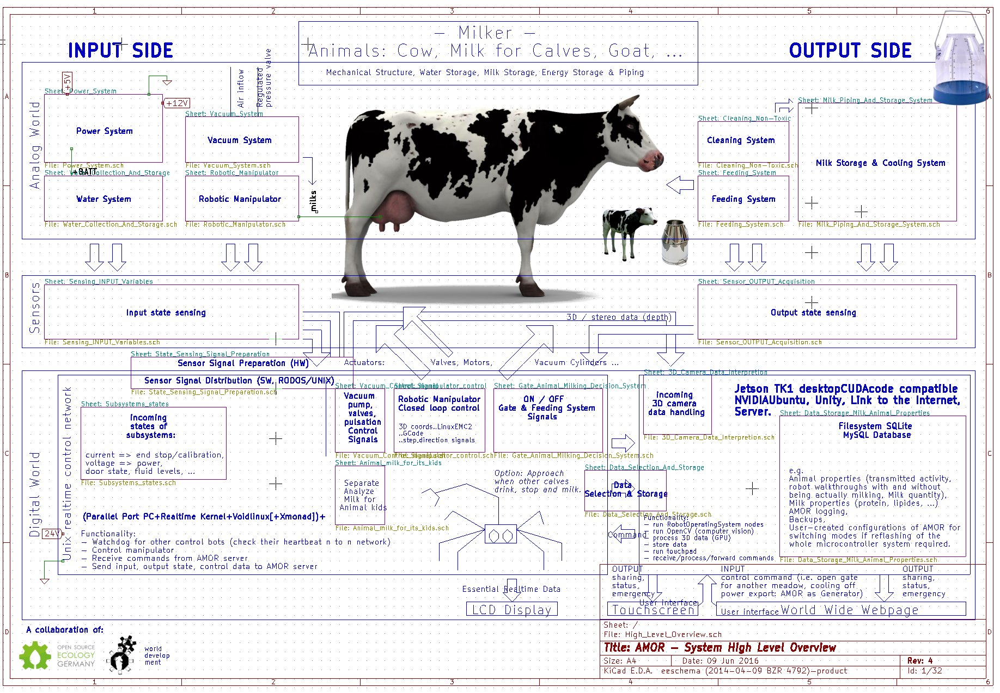

<a href="http://wiki.opensourceecology.de/index.php/milker">Milker</a> (autonomous milking and other robot)
===

###Indoor or outdoor (or both) mobile automaton for milking, feeding and herd management (among others), i.e. common task a human milker would perform.

Overview schematic
---

Characteristics
---
###Possible manipulator configurations:
* 1 Robotic 6 axes manipulator.
* 2 Robotic 6 axes manipulator. Each the watchdog of the other one respectively.
* Animal child like: 6 axes manipulator + mobile base. (Approaching the animal to be milked in time and then even be allowed to "drink" from it will be the major issue.)

If 2 robotic arms are employed, then redundancy and operating speed (due to robotic cooperation) is increased. Yet path calculation is complicated (because next to the cow, the other manipulator is another dynamic obstacle to be collision avoided). If the simplistic specialized manipulators are used, then waiting time has to be calculated too because the reachable workspace is limited and the flexibility of the manipulator is far less than the industrial robot (earth worm).

* The recommended setup is to construct 2 independent, mirrored milking robots next to each other, such that both can help or replace each other.

###Milk container configurations
While the pipings and vacuum system will be built-in, an arbitrary milk container should be added.
Thinkable solutions may be:
* Pipe or tube downhill to the milking chamber where the container is located.
* Pump or suck the milk into a freely located container.
* Add a milk container and cooling system directly to the AMOR construction. (Requires reachability of the milk truck or similar.)May conflict with the mobility of the robot as well as with the  herd management.
* ...

###Milk management
Milk can be redirected to outlets for calves' milk and to the waste exit (waste system connected or left to nature).

###Water supply
It may harvest water from rain, a river, stream or any other water source, a water inlet for connection to the farm's water supply exists.

###Energy supply
* stand-alone (self-sustained, e.g. regenerative energy harvest) or
* external supply (e.g. plugged or transmitted from an electric grid, emergency power supply, or similar).

###Docking process
* A 3D camera determines the udder's, teats' positions.
* The robotic manipulator calculates the tool's teat cup grip and teat dock orientations.

* Paths are calculated:
  1. from current tool position and orientation (:= pose) to the teat cup grip pose.
  2. from the teat cup grip pose to the teat cup grip pose.

###Milk container cleaning system
(missing)
###Autonomous meadow management
(missing)

Research & Development
===
* mobile system
* manipulator docks teat cups

* vacuum (sucking, valves)
* electricity
* control feeding, gates

* gates configurations:
  * gate at one side of the frame, actuated by motor
  * gate left and right with an right angle flexible hold 1 side, push the other with 1 cylinder connected inbetween.

* water (via water supply, garden hose, stream, lake, rain, ...)
* cleaning
* drink water
* food contact surface cleaning.

* container interface (mechanical?, electrical 1 phase AC)
* 7 buckets for the new born animals put under valve controlled outputs, a  Display showing 1..7: id_milk_origin without temperature measurement as the way may be long to the youth and thus the liquid may cool thus divert this task to other beings.

* ROS / RODOS (Realtime onboard dependable operating system) supports ARMv7 (=>BBB); not Raspberry Pi as it is neither real open source (processor) nor are the schematics available due to 'manufacturing contract' with RS, Farnell/element14 and Reichelt - that and too high real time jitter in the region of 4..20 [Xanomai + Linux] over 10..80 [Realtime Linux Kernel] to 600 [Realtime Linux Kernel again, sources vary!] so that PWM would only be possible with a frequency of 1 Hz or below in the latter case. The unit is micro seconds.
* BBB has 50+ GPIOs vs. 8 GPIOs of Rpi.
* BBB has 8 PWM pins vs. 0 on the Rpi.
* BBB has Cortex 8 1GHz processor vs. 700 MHz of the Rpi and the technology used in the BBB processor from TI uses parallel instructions among other improvements in preformance that make a big difference as first tests show [Source: Michael Leonhard].
* BBB has ADC modules inbuilt. (though DAC would be possible with both using a small external circuit or even pure software high frequency pin switching what is not viable as we need the computing power for our robotic manipulator.)
* BBB is supported by LinuxEMC ARM.

* HW-nahe Lösung ist RODOS, yet as the system has to fulfill more services like serving webpages, Void Linux or Jetson Tegra Ubuntu may be used as well as a
  * low level driver
  * use of ROS & MRTB.

* Power supply from a PC (directly from the web server desktop?)
* complement energy requirements via PowerCube or grid connector (note though that conductor wires are expensive for high power and distance).
* or from a truck's generator (a pulling vehicle is required for moving the mobile platform anyway)

* micro grid AC: to emergency AC aggregate or other energy sources with battery and STATCOM (static compensator).
No transformers required for low distance < 100 m at 3 phase to phase voltage 400+V at the required power magnitude of some KW.

* micro grid DC (if DC loads dominate): 12V/24V/36V/48V/60V generator/aggregate and solar cells or other direct current sources as hydro power plant. Batteries and maximum power point tracking (MPPT).
No transforming (DC-DC Wandler) at milking system distances < a few metersrequired. Direct current also not suffers from skin effect.

* milk consistency or online inhibitor (Hemmstoff) recognition to decide usage.

* A fifth (5th) teat cup may be omitted if:  In the Off-time (also called D-phase) when the udder teat vacuum is switched off, we open a valve for immediately dropping the milk to ground (this is no problem as no cow will ever lay down there - AMOR is for milking, not sleeping). During the On-time the teats are cleaned .. reusing the pre-milking yield that serves for removing dirt!! Then this milk is ejected directly at the teat! (it may require lengthening the off interval). Advantages:
  * cleaning of pipes no longer necessary after each milking but teat cups have to be cleaned and are automatically when premilking the next cow, (only if a cow is being detected as having mastitis or similar infections. To determine this, we still have to send the milk farther to the milk property sensing system which probably will be too expensive to be added to each teat cup (even though the weight would be required for better milking during the low-milk-yield phase as to not lock the milk path by the cluster sucking to far up to the udder), so it's better to keep the sensing system globally. Hence after cleaning, we send some milk through the pipe for inspection. This may take some seconds and serves as a delay which is common practice to make the cow release oxytocin to start milk ejection. 15 years after WWII the stimulation effect was even more significant, nowadays this is bred away - so cows are less sensitive to that.) If everything is fine, the milking procedure starts and the vacuum switches to 10 .. 13 inch Hg vacuum average teat cup pressure. No adaption to this is required though the vacuum level could be stepped up while in the maximum/peak flow phase, but this will save only seconds of machine-on time. Thus we will keep the vacuum level constant and instead remove the teat-cups once a cow has exceeded the milk-time treshold (including the milk yield) or the ACR (automated cluster removal) threshold (e.g. .75 L/min or .2 Kg/min for 3x+ milking the same cow a day).
  * material & cost reduced as we spare the 5th teat cup
Of course this comes at a cost: the need of electrical wiring - but this is 2m length and thin wiring only and had been necessary anyway at the end of the vacuum line.

* Milk yield monitoring will be locally different than the milk health property sensing as the milk from the milk conductivity et alia sensing will be put away as waste directly after coming from the measuring chamber. Also, for cleaning of pipes after detecting mastitis as positive and at fixed times each day water needs to circulate (a garden hose may be stuck into the teat cups one by one). A non-used calf-milk output can still be used as the exit point for dirt, cleaning water or mastitis milk. (if all slots are used, this is not possible, then we use the exit in the milk properties or wait with cleaning until one slote is freed. We can even skip cleaning process after mastitis detection as the method is unreliable anyway and in real world centralised farms the piping of buckets also is not always cleaned once mastitis milk has gone through one bucket's pipe or valve or teat cup. Especiially this is not required here as we have the main waste exit directly at the teat cups, so only a very small amount (as much as required for milk property sensing) is flowing through the piping in all cases.

* Filters are installed, have to be cleaned regularly.

* Diameter of vacuum hosepipes can be equal to common  4-teat cup milking machines that alternate pulsation left, right. All 4 teats can be milked simulatneously because there is a hose for each teat cup.

  *
* Natürlich brauchen wir stattdessen dünne Kabel zur Steuerung des Ventils, aber diese kosten wenig - und könnten zur Heizung der Milchschläuche verwendet werden sollten sie zufrieren. Das aufwickeln und abwickeln halten zumindest feinadrige silikonisolierte Kabel gut aus.

Omitting the cleaning procedure is an important concept and possible as the cows are living in freedom also in winter and thus are clean in every season:

* The entire valve system at the teat cups can be dropped. As such devices are not available and are not easy to manufacture yourself. In some countries, like Australia and Canada to my knowledge, they also don't stimulate or clean teats at all as pasture cows are quite clean because they lay on grass.

* Using Kinect/Xtion many channels/topics are sent.

* Cows, goats, sheep can be milked by exchanging the cluster sizes and liner specifications as well as program settings (milk amount, rate for termination, sensor values and milk health tests).

* BBB controls stepper motors of the manipulator.
* NVIDIA Jetson controls high level decisions, distributes commands and processes the 3D camera input.
* Webserver can be a simple watertight laptop / desktop system or Jetson ARM.
* The power system integrates with alternative energy (solar & steam as cooling the milk will give plenty of heat back - water storage will be heated up as an energy storage).

* Vacuum pump can be all from vacuum cleaner to diffusion pump as only a low degree of vacuum is required. (It's not an electron beam precision machine!)

* vacuum cylinders or mechanic springs for tolerating being hit by animal: 1) A spring high. 2) The tether low.
 One may add a strong spring at the low side.

* If position determination is stable at the tool tip then not necessarily stepper motors need controlling. Else use vaccum cylinders and encoders as easy as a variable resistor / potentiometer.

* feeding tank interface to frame (refill notification)

* milk property sensors

* send data per radio/wifi to web server which operates touch screen, sends notifications (mail) and generates HTML5 pages.

* may use simple, quick UDP protocol as individual measurings (lost packages) may be neglected to a degree.

* redundancy via watchdog in two manipulator system

* liquid transport via hoses (sufficient for low flow rate of a single animal => only 1 milking tool and no non-flexible pipes => less hardware => less maintenance).

* animal platform: grid/grating with wood plugs for foot stability? or rubber mats + plow system operated by manipulator or pressurized water.

* sensors for: voltage, current, milk flow, purity of milk, cell count for separating.

* Clean teats using fifth cup with water hose / rotational / longitudal brush.

* provide way for milk fetching vehicles.

Power
---

* DC-only system. That solves our energy problem as we have no longer AC requirement. Furthermore a motor of 250 W as a vacuum pump is enough (delivers 16+ inches Hg of vacuum and we only need 10..13 " Hg). So the only problem left from the energy consumption side is the cooling and cleaning, ie. a water pump. The stepper motors have a modest power rating too (2A * 24V = 48W) and we have approximately five of those (1x door, 3x robot, perhaps 1x feeding system).

* This power consumption sums up to: P = 250W (vacuum) + 250W (water pump) + 5 * 50W (stepper motors) = 750W (< 1KW).

* The power consumption of the electronics is negligible. Especially relative to an optionally included cooling and stirring system for let's say 5000 l milk.
* This will add: P_milk_tank = 2..3 KW (cooling) + 250..750 W (mixer) = 2250..3750 W.
* In total this gives: P_total = 3000..4500 W (so a minimum of 3KW and a maximum of 4.5KW).

### Separate high power components

It may be better to either have either:
* a small easy to cool tank or use solar cooling or to keep the milking system close to a power outlet and lay a power cord!
* Or to use a hose to direct the milk directly into the milking chamber. A smaller diameter connection may be possible when there is enough time to get rid of the milk, i.e. when inbetween subsequent animal milkings there is a significant amount of time.

A small tank is needed on the mobile robot for the vacuum system anyway. If we choose the location of the milking robot wisely then we don't even need a pump (height difference).

An autonomous self-cleaning milk tank is a future goal. It has to seal the milk tank better and prevents wildlife (deer, foxes, ..) from draining the milk reservoir.

Whether it's better to have this autonomous tank close to the robot or whether it's cheaper and more practical to keep it in a milking chamber nearby remains to be determined.

This is what supports the remote milk tank:

* Having the tank nearby or in a milking chamber is no bad thing (especially in winter and stormy weather)
* and reduces weight
* and size of the milking robot.
* It also saves the AC power cord to the milking robot
* and also lessens the water demand.

All this comes at a cost:

* Food quality hose or flexible piping is required to get the milk from the robot to the tank. This is compensated for by the no-longer required water hose.
* But finally a pump could become necessary if there is no chance to use gravity (height difference). This could be compensated for by reusing/reconfiguring the milking robot cleaning pump or water compressor and somehow use it for both cleaning of the robot and pumping milk be pressurizing an air vessel (as a possible solution so as to not have get in direct contact with milk that again would need food quality pump and probably render the compressor unsuitable for this purpose).

#### Cooling by burying tank (credit Oliver)

1. Tank in die Erde verlagern, unterhalb d. Frostgrenze von ca. 80cm Tiefe herrscht durchgehend ca. 10°C. Durch zusätzliche Kühlung muss nur noch ca. 6°Kelvin überbrückt werden.

2. "Eiskeller" ist, was die Leute früher gemacht haben, als es noch keine Kühlschränke gab. Wird auch in die Erde gebaut und der tank dann mitten rein plaziert.

3. Solange die Jahresezeit noch genügend kalte Nächte hat, nächtlicher Wärmetausch.

4. Etwaige noch verbleibende Deckungslücken mit langem Stromkabel decken, wie von Dir skizziert, aber damit ist der Strombedarf schon auf ein Minimum reduziert. Falls dieses Minimum klein genug ist, wäre ev. auch solares Inselsystem möglich, ein Stromspeichersystem wie die <a href="http://wiki.opensourceecology.de/Zn/O-Brennstoffzelle">Zn/O-Zelle</a> wäre hier natürlich eine gute Unterstützung.

Dann wäre wohl weiter ein komplett unisolierter Tank von Vorteil. Mensch, Oliver, solche Tänke sind ja auch viel einfacher herzustellen! Das ist wirklich ein bahnbrechender Vorschlag.

### DC only system summary
A DC-only system has many benefits, some of them mentioned above, and opens up the possibility to decouple energy supply of most of the mobile robot from heavy power consumers like the cooling system.

The AC loads still can be fed through an ordinary power cord which is readily available for both 1-phase and 3-phase (the latter more expensive than the former).

Alternatively the AC loads could be outsourced reducing system weight and the space required.

* If the power supply of the vacuum system and electronics is decoupled from the cooling and tank cleaning system the way it is sketched above then robot mobility increases as
* e.g. no hard energy link is necessary. Direct Current is not necessarily a requirement for that but simplifies the process a lot as most alternative energy harvesters generate DC as do the electronics and the step motors (as there only individual phases are energized despite it having more wires than two). This increases efficiency and lowers complexity because there is no more need to convert from AC to DC and then from DC to AC again (as for motor control).

## Vacuum pump

Here a vacuum pump that meets our requirements and is manufactured in Europe:

Ich rede zu viel, hier meine Taten, Vakuum System Revision 2. Jetzt doch mit mechanischem Vakuumregler (das war mir doch zu gefährlich für die Kuh in der Testphase den Vakuumdruck jetzt nur rein elektrisch und auf Sensorbasis zu regeln).

Jetzt muss nur noch ein passendes Ventil (engl. Valve) gefunden werden.

## Crazy energy ideas

* Angenommen, die Herdentiere grase auf einem Steilhang. Nun die Kühe im unteren Teil Wasser saufen lassen, den Melkroboter aber oben aufstellen ...
* Den Tank wiederum auf so tiefe Höhenlage wie möglich versetzen. Die Milch, die vom Melkroboter zum Tank fließt, lassen wir eine Turbine antreiben. Hat man entweder viele Tiere, oder aber eine Höhendifferenz von mehr als 50 Metern, so ist die Stromausbeute schon etwas signifikanter.

* Bekommt man die Abfälle von den Tieren in ein riesiges Schaufelrad, so hat man mächtig Gravitationsenergie. (aber der Dünger fehlt)

* Methan-Gase könnten eingefangen und als Treibstoff verwendet werden.
* Unter der Weide könnten Wellen verlegt werden, die durch das Auftreten der Tiere auf eine Platte Wasser hochpumpt (oder direkt einen Generator antreibt). In beiden Fällen muss verhindert werden, dass die Welle zurückdrehen kann, also muss es wie eine Ratsche funktionieren.
* Erdwärme wäre super, ist aber erst nach 2km bei ungefähr 50°C (bei der Temperatur [und der Tiefe, also dem Druck] splittert Felsen wie Glas!!),

* Also nehmen wir den Blitz ... das ist unsere einzige Chance. Da kommt Wärme sprichwörtlich vom Himmel und schnell wie der Blitz. Es gibt Materialien, die können aus Wärme direkt Strom herstellen ... nur wie bringt man den Blitz dazu, seine Wärme und Spannung in das Glühen eines Metalls umzuwandeln? Der Blitz wird aufgrund der hohen Spannung einfach durchschlagen, die Frage ist also: Wie baut man einen Blitzfangapparat, der den Blitz regelrecht dazu auffordert stündlich einzuschlagen und dennoch nicht zu schmelzen, zu bersten oder sonstige Schäden zu nehmen.

### Energie durch Höhenunterschied Melkroboter Tank

Also, ich habs grad mal kurz überschlagen. Eigentlich wollte ich im Rahmen meiner Argumentation damit ja zeigen, dass da eine lächerlich geringe Menge bei rauskommt ;) aber sofern ich keinen gravierenden Fehler gemacht habe, ist es anscheinend doch erstaunlich viel.

Meine Berchnung basiert auf der Wasserturbinenformel von http://de.wikipedia.org/wiki/Wasserturbine, wobei ich vereinfachend den Wirkungsgrad der Turbine mit 100% annehme, und die Dichte von Milch mit Wasser gleichsetze und die Rohrreibung ausser acht lasse. Damit ergibt sich zunächst als Nennleistung der Milchturbine in KW:

    P_mt = Wirkungsgrad_in%_auf_1_normiert * Dichte * Gravitätskonstante [(Planet Erde, 2014)] * Fallhöhe * Volumenstrom

    P_mt = 1 * 1 * 9.81 * 300 * Volumenstrom

Den Volumenstrom kann ich nur grob einschätzen, aber ich weiss, dass es ungefähr 1min dauert, einen 10L-Eimer-Wasser voll laufen zu lassen, wobei auf der Wasserleitung normalerweise 4bar Druck herrschen, die ich hier nicht berücksichtige, bin mir nicht ganz sicher ob [man] diesbezüglich das Endergebniss nochmal durch 4 teilen müsste[], aber ich lass es hier erst mal weg.

Weiters nehme ich an, dass bei der Hauswasserleitungd er Rohrdurchmesser 1/2" (1/2 * 2.54cm) beträgt und beim Milchturbinenrohr 10cm. Daraus folgt

    Volumenstrom_Wassereimer = 10L/60s = 0,167 L/s

Die Querschnittsfläche eines 1/2"Rohrs beträgt 1,266cm^2, die des großen Milchrohrs 78,5cm^2, das ergibt ein Verhältniss von ziemlich genau 1:62, d.h.

    0,167 L/s * 62 = 10,35 L/s = 0,01035 m^3/s ([m^3/s] ist die Einheit die wir für die Formel brauchen.)

Mit diesem Volumenstrom können wir nun die Turbinenformel vervollständigen und es ergäbe sich eine KW-Leistung von

    P_mt = 1 * 1 * 9.81 * 300 * 0,01035 =30,46 KW

Re: AMOR - Automated Milking Ongoing Robot
---

Läuft die Milch nun eine Stunde lang ununterbrochen hätte man also 30,46 KWh, aber die Frage ist dabei, wie gross der Tank ist. Du sprichst [] weiter oben bei Deinen Kühlungsberechnungen von einem 5000L-Tank, wenn ich nun davon ausgehe, das die Viecher zweimal am Tag gemolken werden, dann lande ich bei 10000L. Um diese bei dem eben berechneten Volumenstrom von 10,35L/s durch das 10cm Rohr laufen zu lassen würde man 16min benötigen, d.h.,

30.46 KW / 60min * 16 min = 8,123 KWh, die Du aus einem 10000L-Tank rausbekämst.

8,123 KWh * 365 Tage = 2964 KWh pro Jahr.

Das klingt doch schon ganz ordentlich.

Allerdings muss man berücksichtigen, dass es sich dabei um mechanische Leistung handelt, d.h., hier käme jetzt noch der Wirkungsgrad des Generators bei der Umwandlung von mechanischer in elektrische Leistung ins Spiel. Da kannst sicher noch einige Prozentpunkte abziehen, je nachdem wie gut Dein Generator ist, aber so ins Blaue hinein würde ich einfach mal pauschal locker 30% Verlust veranschlagen.

Bleibt noch die oben erwähnte Sache mit den 4bar Druck auf der Wasserleitung, ich bin mir wie gesagt nicht ganz sicher, ob die hier wirklich zu veranschlagen wären, denn selbst wenn auf deinem Milchtank stattdessen nur eine Atmosphäre = 1bar Druck lastet und die Milch entsprechend 4 mal langsamer rausgedrückt, dann sollte sich am Gesamtergebnis doch eigentlich nichts ändern, weil der dann kleinere Volumenstrom dafür dann auch enstsprechend 4 mal länger läuft und Strom erzeugt, d.h., an der Gesamtkapazität des 10000L-Tanks würde sich nix ändern.

Re: AMOR - Automated Milking Ongoing Robot
---
haha, du bist der beste :) ich warte noch mit den Rohren, erfahrungsgemäß sind 10cm-Durchmesser-Rohre schwer zu bekommen, und dann müssten sie noch Lebensmittelgerecht [e.g. Edelstahl 1.4301+, citation needed] sein.

Danke für die Berechnungen, sehr aufschlussreich.

Ich denke auch, dass der Druckunterschied über die Zeit keinen Unterschied macht. Zumindest bei Turbinen deren Geschwindigkeit hauptsächlich aus Schwerkraft resultiert. Bei High-speed-Impulsturbinen kommt die Geschwindigkeit ins Spiel. Ein größeres Druckgefälle von oben nach unten könnte dabei eine größere Beschleunigung des Fließmediums (hier Milch) erwirken. Das hätte eine größere Geschwindigkeit zur Folge (und größeren Volumenstrom wie du bereits nanntest insofern oben genug Milch vorhanden ist). Leider ist das Druckgefälle hier andersherum: von unten nach oben. :/

Der Druckunterschied schiebt dabei die Milch entweder an oder bremst sie (zusätzlich zu der Rohrreibung). Ich denke allerdings, dass der Impulsgewinn mit dem Volumenstrom in der Formel bereits abgedeckt ist.

Doch ich denke du hast den entscheidenden Punkt schon angesprochen. Selbst wenn wir alle milchgebenden Kühe, die dort oben grasen, (~1000) zusammenrechnen, ist immer noch fraglich, ob permanent Milch fließen würde. Und um all diese Milch zu nutzen, müssten alle Kühe/Bauernhöfe den selben Melkroboter nutzen. Und der Melkroboter müsste die Milchmenge anteilig berechnen und an den Milchwagen weiterleiten.

Aber zurück zu deinem Druckunterschied. Ich denke noch immer, wir können dadurch eine Menge herausholen. Du ahnst es bestimmt. Ich arbeite seit einiger Zeit an Plänen zur Energiegewinnung durch genau dieses Prinzip - und einem weiteren: Temperaturdifferenz. Einmal wollte ich sogar einen unterirdischen Tunnel senkrecht in den Boden graben, um an Rohrlänge zu sparen ...

Ob Schacht graben wohl vorteilhaft gegenüber Turmbau ist?

Das mit der Milch muss ich wohl vergessen, da:

* Nicht alle Landwirte mitmachen würden (und deshalb die Milchmenge zu gering wäre, also nicht rund um die Uhr hinabfließen würde).
* Strenge Vorschriften gelten im Umgang mit Milch. [Kein Hindernis falls Milch sachte behandelt, also keine durchschlagen, ...?]

* [Viele Landwirte (insbesondere Bio) Einzelverträge mit Molkereien aushandeln und die Milch nicht gemischt werden darf.]

Ha[]t zufällig irgendwer eine Steilklippe in bei sich in der Nähe? In der Sächsischen Pfalz müsste es das doch sicher geben - gibt es dort auch Klippen, die 100..300 Meter tief sind?

Gräben würden auch gehen. Umso senkrechter, desto besser.

Wir müssten die Mining-Industrie dazu animieren, endlich Turbinen ohne Schnickschnack aus rechtlichen und sicherheitstechnischen Gründen nur bei den Ein- und Ausgänge der Minenschächte einzubauen, zumindest bei den stillgelegten. Unter 1,5km Tiefe herrschen +50 °C (s. Grafik), da splittert der Fels wie Glas .. und die Luft schießt nach oben wie der Blitz.

Jetzt hab ich mich geoutet ... ich hoffe, wir finden endlich eine Lösung für das Energiedilemma. Meine Hoffnung schwindet langsam, wenn ich nicht bald bessere Ideen habe und etwas fruchtbares Zustande bekomme.

Zu dem genannten Energie-Kamin werde ich baldmöglichst Berechnungen durchführen und alles in einem 'Proposal' Dokument zusammenfassen. Solche Projekte kann nur die Gesellschaft als ganzes tragen (es geht um Hunderte Meter Rohre .. und die Grundversorgung eines ganzen Dorfes.).

Im 19. Jh. hat man den Thames-Tunnel gegraben - mit Schildvortrieb: Mit der Neu-Österreichischen-Tunnelbautechnik mit Spritzbeton zur Absicherung sollte man meinen, man könnte einfach so unter Mittelgebirge durchgraben und eigene Erdbewegung unterirdisch ausführen (z.B. für Hallenbau) ... doch frage ich mich, ob es nicht nur bei Felsgestein funktioniert? Zur Festigung von Erdschichten wird Spritzbeton wohl kaum den 90%ig selben Effekt haben?
Image

Tunnelbau vs. Turmbau ist relevant, da wir so Pumpspeicherkraftwerke und Wasserkraftwerke leichter und kostengünstiger bauen könnten (vorausgesetzt, der Tunnel oder Turm wäre bereits natürlich gegeben, z.B. durch eine Schlucht.)

[Ein Tunnel benötigt einen Ablauf für das Medium, also beispielsweise Versickerung oder einen horizontal gegrabenen Ausgang und weitere Ableitung (zur Verteilung).]

